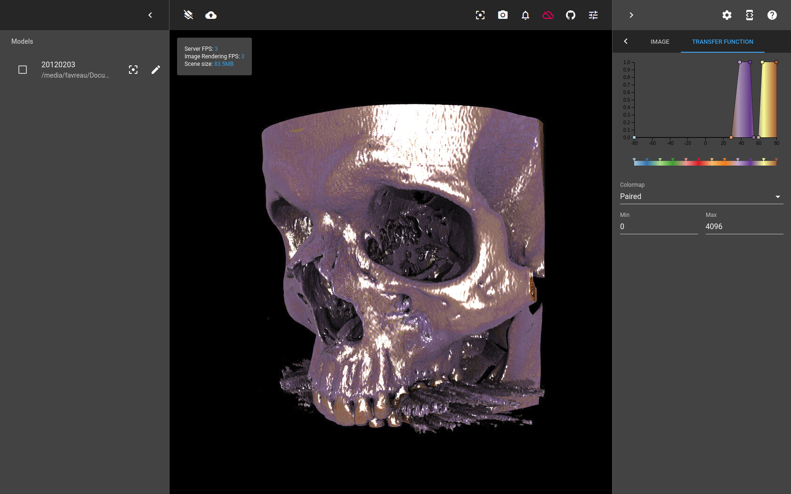

# DICOM plugin for Brayns

## Description
This module implements the visualization of DICOM datasets with [Brayns](https://github.com/BlueBrain/Brayns)

## Build on Linux

### Prerequiries
- Build [Brayns](https://github.com/BlueBrain/Brayns) and install it into ${BRAYNS_INSTALLATION_FOLDER}
- Install dcmtk
```bash
sudo apt install libdcmtk-dev
```

### Build from source

```bash
git clone https://github.com/favreau/Brayns-UC-DICOM
cd Brayns-UC-DICOM
mkdir build
cd build
CMAKE_PREFIX_PATH=${BRAYNS_INSTALLATION_FOLDER} cmake .. -DCMAKE_PREFIX_PATH=${BRAYNS_INSTALLATION_FOLDER} -DCMAKE_BUILD_TYPE=Release
```
This will build and install libdicom.so


## Usage
- Set PATH and LD_LIBRARY_PATH
```bash
export PATH=${BRAYNS_INSTALLATION_FOLDER}/bin:${PATH}
export LD_LIBRARY_PATH=${BRAYNS_INSTALLATION_FOLDER}/lib:${LD_LIBRARY_PATH}
```
- Run Brayns application either with command line '--plugin dicom'
```bash
braynsService --http-server :5000 --plugin dicom
```

## User interface
A user interface is currently available as a [docker container](https://hub.docker.com/r/bluebrain/brayns-ui/)
```bash
docker run -ti --rm -p 8080:8080 bluebrain/brayns-ui
```
Once the container is running, access the web UI at http://localhost:8080?host=localhost:5000

## Python
Install the brayns package in your favourite Python 3 virtual environment:
```bash
virtualenv -p python3 venv
. ./env/bin/activate
pip install brayns
```
Connect to Brayns and load DICOM data:
```python
from brayns import Client
brayns = Client('localhost:5000')

# Set renderer that supports volumes
brayns.set_renderer(current='scivis', head_light=True, samples_per_pixel=1)

# Load data
brayns.add_model(path='...') # Path to the DICOM folder

# Set rendering parameters
p = brayns.ScivisRendererParams()
p.shadows_enabled = False
p.ao_weight = 1
brayns.set_renderer_params(p)
brayns.set_volume_parameters(
    specular=(0,0,0),gradient_shading=False, single_shade=False,
    adaptive_sampling=True,adaptive_max_sampling_rate=1, sampling_rate=1)
```
For more information about the Brayns Python interface, see the [documentation](https://github.com/BlueBrain/Brayns/tree/master/python).

## Screenshots

